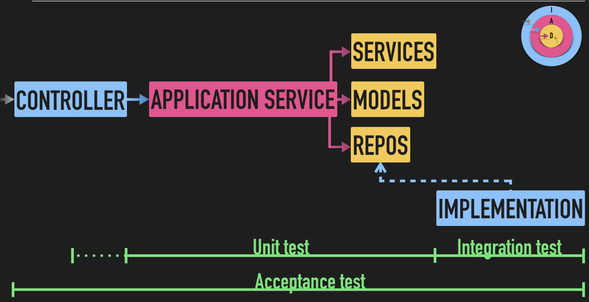

# ☝🏻 UnitTest

You may test your code independently of the rest of the system by using unit testing. It is a quick and effective approach to test how your code behaves. It also serves as a means of code documentation. The code they test is performed independently from unit tests, which are written in a different file. This implies that you may run your unit tests concurrently and as frequently as you like.

## 📝 How to write unit tests in Go:

1. Create a file with the suffix `_test.go` in the same directory as the file you want to test.
2. Import the `testing` package.
   
   - [Testing package](https://golang.org/pkg/testing/)
   - [Testify](https://github.com/stretchr/testify)
3. Create a function with the prefix `Test` and the name of the function you want to test. (see example fizzbuzz_test.go)

## 💎 Unit test and clean architecture

## 🏃🏻‍♀️ Considerations and Good practices

### 🤓 General

- Test functions should be independent of each other.
- Unit test should be fast.
- Unit test should be isolated.
- Unit test should be repeatable.
- Unit test should be self-validating.
- Unit test should be timely.
- Unit test are not necessarily exhaustive.

### 😎 Design

- Unit test are not necessarily one-to-one with classes, structs or methods.
- Test coverage main goal is to provide confidence that the code is working as expected.
- Do not modify a test to make it pass.
- Do not modify a test without a new business requirement.

